# Documentation Map

A guide to finding documentation across the Anokye Plugins repository.

## By Audience

### New Users
| Document | Description |
|----------|-------------|
| [README.md](../README.md) | Project overview, installation, and quick start |
| [omanfo/README.md](../omanfo/README.md) | Omanfo plugin overview and what gets installed |
| [ahuofe/README.md](../ahuofe/README.md) | Ahuofe plugin overview, skills, and script inventory |
| [omanfo/how-we-work/getting-started.md](../omanfo/how-we-work/getting-started.md) | Newcomer guide to the Anokye System |
| [omanfo/how-we-work/glossary.md](../omanfo/how-we-work/glossary.md) | Akan terminology glossary |

### Contributors
| Document | Description |
|----------|-------------|
| [CONTRIBUTING.md](CONTRIBUTING.md) | How to contribute — prerequisites, testing, PR process |
| [WORKFLOWS.md](WORKFLOWS.md) | GitHub Actions workflow reference (all 13 workflows) |
| [CLAUDE.md](../CLAUDE.md) | Codebase conventions and agent guide |
| [.github/copilot-instructions.md](../.github/copilot-instructions.md) | Copilot agent behavior rules |

### Agent Developers
| Document | Description |
|----------|-------------|
| [CLAUDE.md](../CLAUDE.md) | Codebase-specific reference for AI agents |
| [.github/copilot-instructions.md](../.github/copilot-instructions.md) | Core workflow rules for Copilot agents |
| [shared/OkyeremanAgentRunner/README.md](../shared/OkyeremanAgentRunner/README.md) | Agent runtime foundation — logging, retry, issue context |
| [omanfo/archetypes/README.md](../omanfo/archetypes/README.md) | Agent archetype templates and deployment guide |
| [omanfo/agents/okyeame.agent.md](../omanfo/agents/okyeame.agent.md) | Okyeame agent persona definition |
| [omanfo/agents/okyerema.agent.md](../omanfo/agents/okyerema.agent.md) | Okyerema agent persona definition |

### System Architects
| Document | Description |
|----------|-------------|
| [ARCHITECTURE.md](../ARCHITECTURE.md) | System architecture with diagrams |
| [anokye-system-vision.md](../anokye-system-vision.md) | Full Akan governance model and long-term vision |
| [ahuofe/docs/ARCHITECTURE.md](../ahuofe/docs/ARCHITECTURE.md) | Ahuofe media plugin architecture and data flows |
| [ahuofe/pipeline/README.md](../ahuofe/pipeline/README.md) | TypeScript generation pipeline architecture |

## By Topic

### Architecture
| Document | Description |
|----------|-------------|
| [ARCHITECTURE.md](../ARCHITECTURE.md) | Top-level system architecture |
| [anokye-system-vision.md](../anokye-system-vision.md) | Akan governance model and vision |
| [ahuofe/docs/ARCHITECTURE.md](../ahuofe/docs/ARCHITECTURE.md) | Media plugin architecture |
| [ahuofe/docs/architecture/plugin-infrastructure.md](../ahuofe/docs/architecture/plugin-infrastructure.md) | Plugin infrastructure patterns |

### Plugins
| Document | Description |
|----------|-------------|
| [omanfo/README.md](../omanfo/README.md) | Omanfo plugin (project management, 12 skills) |
| [ahuofe/README.md](../ahuofe/README.md) | Ahuofe plugin (media generation, 6 skills) |
| [shared/README.md](../shared/README.md) | Shared PowerShell modules index |

### Testing
| Document | Description |
|----------|-------------|
| [ARCHITECTURE.md — Testing Architecture](../ARCHITECTURE.md#testing-architecture) | Testing tier breakdown and commands |
| [tests/omanfo/README.md](../tests/omanfo/README.md) | Omanfo test suite documentation |
| [shared/CLITestHarness/README.md](../shared/CLITestHarness/README.md) | E2E test harness for CLI providers |

### CI/CD
| Document | Description |
|----------|-------------|
| [WORKFLOWS.md](WORKFLOWS.md) | All 13 GitHub Actions workflows |
| [ARCHITECTURE.md — CI/CD Architecture](../ARCHITECTURE.md#cicd-architecture) | Workflow categories and Auto-Flow pipeline |
| [workflow-templates/README.md](../workflow-templates/README.md) | Reusable governance workflow templates |
| [workflow-templates/CONFIGURATION.md](../workflow-templates/CONFIGURATION.md) | Workflow template configuration |

### Governance & Conventions
| Document | Description |
|----------|-------------|
| [omanfo/how-we-work.md](../omanfo/how-we-work.md) | Coordination overview |
| [omanfo/how-we-work/our-way.md](../omanfo/how-we-work/our-way.md) | Opinionated workflow conventions |
| [omanfo/how-we-work/glossary.md](../omanfo/how-we-work/glossary.md) | Akan terminology glossary |
| [omanfo/how-we-work/adr-process.md](../omanfo/how-we-work/adr-process.md) | Architecture Decision Record process |
| [omanfo/how-we-work/adr-template.md](../omanfo/how-we-work/adr-template.md) | ADR template |

### Scripts
| Document | Description |
|----------|-------------|
| [scripts/README.md](../scripts/README.md) | Repo-wide utility scripts (7 scripts) |
| [ahuofe/README.md — Scripts](../ahuofe/README.md#scripts) | Ahuofe script inventory (20 scripts) |
| [ahuofe/docs/api-reference/scripts.md](../ahuofe/docs/api-reference/scripts.md) | Ahuofe script API reference |

### Media Generation (Ahuofe)
| Document | Description |
|----------|-------------|
| [ahuofe/docs/user-guides/getting-started.md](../ahuofe/docs/user-guides/getting-started.md) | Getting started with media generation |
| [ahuofe/docs/user-guides/image-generation.md](../ahuofe/docs/user-guides/image-generation.md) | Image generation guide |
| [ahuofe/docs/user-guides/image-processing.md](../ahuofe/docs/user-guides/image-processing.md) | Image processing guide |
| [ahuofe/docs/user-guides/workflows.md](../ahuofe/docs/user-guides/workflows.md) | Workflow orchestration guide |
| [ahuofe/docs/examples-gallery/](../ahuofe/docs/examples-gallery/) | Example gallery (basic, advanced, image processing) |
| [ahuofe/docs/security/](../ahuofe/docs/security/) | API key management and secret handling |
| [ahuofe/pipeline/README.md](../ahuofe/pipeline/README.md) | TypeScript generation pipeline |

### Research
| Document | Description |
|----------|-------------|
| [research/README.md](../research/README.md) | Research notes index |
| [research/claude-agent-teams.md](../research/claude-agent-teams.md) | Claude agent team patterns |
| [research/copilot-fleet-mode.md](../research/copilot-fleet-mode.md) | Copilot fleet mode analysis |
| [research/gastown.md](../research/gastown.md) | GasTown multi-agent workspace analysis |
| [research/strongdm-software-factory.md](../research/strongdm-software-factory.md) | StrongDM Software Factory analysis |

## Documentation Tree

```mermaid
graph TB
    Root[README.md] --> Arch[ARCHITECTURE.md]
    Root --> Claude[CLAUDE.md]
    Root --> Vision[anokye-system-vision.md]

    subgraph "docs/"
        Nav[NAVIGATION.md]
        Contrib[CONTRIBUTING.md]
        WF[WORKFLOWS.md]
    end

    Root --> Nav

    subgraph "omanfo/"
        OR[README.md]
        HW[how-we-work/]
        Agents[agents/]
        Archetypes[archetypes/]
    end

    subgraph "ahuofe/"
        AR[README.md]
        ADocs[docs/]
        APipe[pipeline/README.md]
    end

    subgraph "shared/"
        SR[README.md]
        Runner[OkyeremanAgentRunner/]
        Harness[CLITestHarness/]
    end

    Root --> OR
    Root --> AR
    Root --> SR
```

