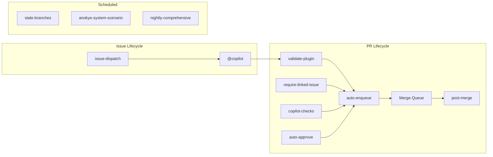

# GitHub Actions Workflows

Reference for all 13 workflows in `.github/workflows/`.

## Overview



## CI — Validation

| Workflow | File | Trigger | Purpose |
|----------|------|---------|---------|
| **Validate Plugin** | `validate-plugin.yml` | Push (non-main), PR to main, merge group | Multi-stage validation: file structure, syntax, skill quality, eval coverage, markdown, PSScriptAnalyzer, Pester unit tests, smoke tests, security scan, mocked E2E tests, 70% coverage threshold, dependency audit |
| **Require Linked Issue** | `require-linked-issue.yml` | PR opened/edited/reopened/synchronize, merge group | Enforces that every PR links to an issue; converts unlinked PRs to draft with gate label |
| **Copilot PR Checks** | `copilot-checks.yml` | `pull_request_target`, manual | Bridge workflow for Copilot-authored PRs — runs validation and triggers auto-approval |

## Governance — Automation

| Workflow | File | Trigger | Purpose |
|----------|------|---------|---------|
| **Auto Approve** | `auto-approve.yml` | PR opened/synchronize/reopened/ready | Auto-approves PRs from trusted actors (Copilot, Claude) when all checks pass |
| **Auto Enqueue** | `auto-enqueue.yml` | Workflow completion (Validate Plugin, Require Linked Issue, Copilot PR Checks), schedule (every 3 min), manual | Sweeps open PRs and enqueues those ready to merge into the merge queue via GraphQL |
| **Issue Dispatch** | `issue-dispatch.yml` | Issue opened/labeled | Auto-assigns Task and Bug issues to `@copilot` when the `auto-flow` label is applied |
| **Post-Merge Lifecycle** | `post-merge.yml` | PR closed (merged to main) | Updates linked issues with completion comments, closes them, handles parent-sub-issue closure cascades |

## Quality — Testing

| Workflow | File | Trigger | Purpose |
|----------|------|---------|---------|
| **Automated E2E Tests** | `e2e-automated.yml` | Push to main (omanfo paths), manual | Runs automated E2E scenarios: sitrep, health, whatsleft, pr-check, issue-creation, plan-materialize |
| **Anokye-System Scenario Tests** | `anokye-system-scenario.yml` | Nightly schedule (02:00 UTC), manual | Full integration and E2E tests validating system-wide functionality |
| **Nightly Comprehensive Tests** | `nightly-comprehensive.yml` | Nightly schedule (03:00 UTC), manual | All test tiers: Pester (unit/integration/E2E/smoke), pipeline Vitest, omanfo Vitest, dependency audit |

## Maintenance

| Workflow | File | Trigger | Purpose |
|----------|------|---------|---------|
| **Stale Branch Cleanup** | `stale-branches.yml` | Weekly (Monday 06:00 UTC), manual | Deletes branches older than 14 days with no open PRs |
| **PR Review Triage** | `pr-triage.lock.yml` | PR synchronize, review events, schedule (every 15 min), manual | Auto-generated by `gh-aw`; triages and manages PR review state |
| **Claude Code** | `claude.yml` | Issue comment, PR review comment, issue labeled | Triggers Claude Code action on `@claude` mentions and `claude` labels |

## The Copilot Auto-Flow Pipeline

The fully automated end-to-end pipeline for Copilot-authored PRs:

```
Issue created (Task/Bug)
    │
    ▼
issue-dispatch.yml
    │ assigns to @copilot
    ▼
Copilot opens a PR
    │
    ├─► validate-plugin.yml    (structure, tests, lint, E2E, coverage, dep audit)
    ├─► require-linked-issue.yml (PR-issue link check)
    └─► copilot-checks.yml    (Copilot-specific validation)
            │
            ▼
    auto-approve.yml
            │ approves if all checks pass
            ▼
    auto-enqueue.yml
            │ enqueues into merge queue (GraphQL)
            ▼
    Merge Queue
            │ required checks run
            ▼
    PR merges automatically
            │
            ▼
    post-merge.yml
            │ closes linked issues
            │ updates parent issues
            ▼
    Done
```

## Related

- [workflow-templates/](../workflow-templates/) — Reusable workflow templates for other repositories
- [workflow-templates/CONFIGURATION.md](../workflow-templates/CONFIGURATION.md) — Template configuration guide
- [ARCHITECTURE.md — CI/CD Architecture](../ARCHITECTURE.md#cicd-architecture) — Architecture-level view
